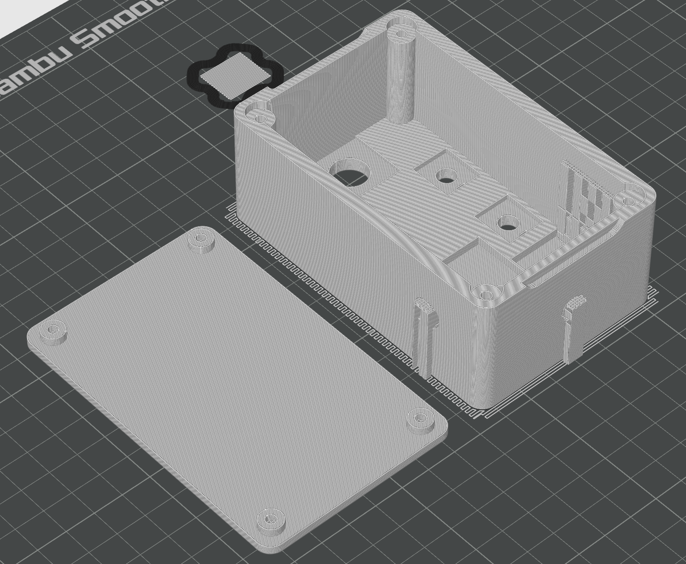
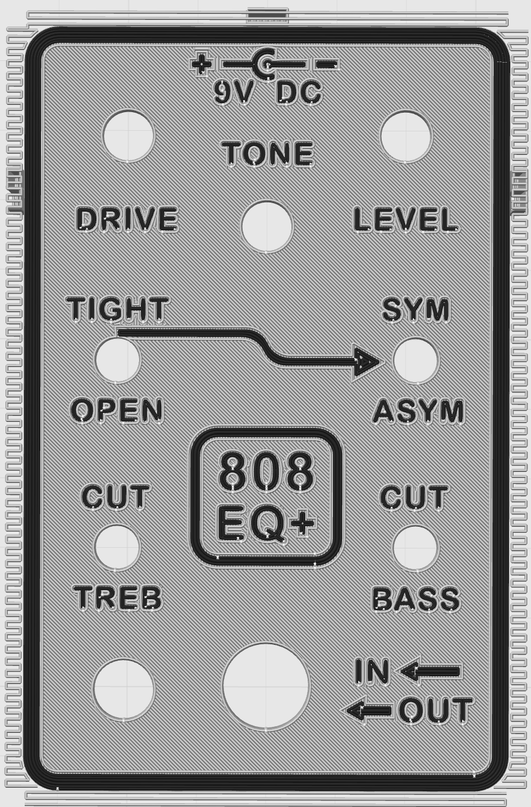

# 808 EQ+ — DIY Build Guide

This guide provides a practical roadmap for building the 808 EQ+ guitar pedal from the files in this repository. It is intended for hobbyists who are comfortable with basic soldering, through-hole electronics, component identification, and 3D printing.

It is not a step-by-step beginner course. Review the entire guide, the bill of materials, and the technical documentation before ordering parts or beginning assembly.

For an overview of the pedal, see the [main README](README.md). For circuit theory, design decisions, PCB development, and enclosure details, see the [Technical Documentation](TECHNICAL_DOCUMENTATION.md).

## Table of Contents

* [Before You Begin](#before-you-begin)
* [Repository Resources](#repository-resources)
* [Bill of Materials and Tools](#bill-of-materials-and-tools)
* [Build Roadmap](#build-roadmap)
* [1. Review the Design and Plan the Build](#1-review-the-design-and-plan-the-build)
* [2. Choose a Circuit-Board Method and Obtain Components](#2-choose-a-circuit-board-method-and-obtain-components)
* [3. Print and Verify the Enclosure Parts](#3-print-and-verify-the-enclosure-parts)
* [4. Assemble the Circuit Board](#4-assemble-the-circuit-board)
* [5. Test the Circuit Board Outside the Enclosure](#5-test-the-circuit-board-outside-the-enclosure)
* [6. Install the Off-Board Components](#6-install-the-off-board-components)
* [7. Complete the Final Assembly](#7-complete-the-final-assembly)
* [8. Perform Final Validation](#8-perform-final-validation)
* [Troubleshooting Guidelines](#troubleshooting-guidelines)

---

## Before You Begin

This project combines analog electronics, circuit-board assembly, off-board wiring, mechanical assembly, and additive manufacturing. A successful build requires careful inspection and staged testing rather than assembling everything at once and troubleshooting only at the end.

> [!CAUTION]
> A regulated **9 V DC, center-negative pedal supply** is recommended. An external 9 V battery adapter is also supported if its 2.1 mm connector polarity is verified before use. Do not apply more than 9 V; the reverse-polarity diode helps protect against reversed polarity but not excessive input voltage.
>
> The enclosure has no internal battery compartment or automatic battery-disconnection feature. The circuit remains powered while bypassed, so disconnect an external battery when the pedal is not in use. Disconnect all power before modifying the circuit or handling exposed connections.

The enclosure was designed around the specific parts listed in the project BOM. Electrically compatible substitutions may still differ in pinout, lead spacing, body size, shaft diameter, thread length, or mounting depth. Verify every substituted part before ordering or modifying the design files.

## Repository Resources

| Resource | Purpose |
| --- | --- |
| [Main README](README.md) | Project overview, features, controls, status, limitations, and general references |
| [808 EQ+ User Manual](808_EQ-Plus_User_Manual.pdf) | Connector layout, control descriptions, operating modes, starting settings, power guidance, and troubleshooting help |
| [Technical Documentation](TECHNICAL_DOCUMENTATION.md) | Circuit operation, prototype development, PCB design, enclosure design, and engineering details |
| [`808_EQ-Plus_Single_Pedal_BOM.xlsx`](Design/808_EQ-Plus_Single_Pedal_BOM.xlsx) | Components, quantities, part numbers, suppliers, and estimated single-pedal costs |
| [`808_EQ-Plus_Tools_and_Fabrication_Info.xlsx`](Design/808_EQ-Plus_Tools_and_Fabrication_Info.xlsx) | Tools, equipment, fabrication resources, and estimated costs |
| [`Design/PCB`](Design/PCB/) | Altium files, libraries, Gerber files, drill files, and other PCB manufacturing outputs |
| [`Design/3D_Printing`](Design/3D_Printing/) | STL files, prepared 3MF projects, and other enclosure-printing resources |
| [Complete schematic](Images/Software/Altium_Schematic.png) | Full electrical schematic for assembly and troubleshooting reference |
| [Perfboard DIY layout](Images/Software/Perfboard_DIYLayout.png) | Layout used for the working perfboard prototype and a starting point for perfboard construction |
| [PCB Design section](TECHNICAL_DOCUMENTATION.md#pcb-design) | PCB construction, socketing, routing, grounding, and manufacturer-selection notes |
| [Enclosure Design and 3D Printing section](TECHNICAL_DOCUMENTATION.md#enclosure-design-and-3d-printing) | Detailed enclosure-design rationale and print-development information |

## Bill of Materials and Tools

### Bill of Materials

The [`808_EQ-Plus_Single_Pedal_BOM.xlsx`](Design/808_EQ-Plus_Single_Pedal_BOM.xlsx) file identifies the parts required to produce one complete pedal. Review it before ordering components or choosing a circuit-board method because the PCB footprints and enclosure were designed around the listed parts.

Many parts can be replaced with electrically and mechanically compatible alternatives. Any substitution should be checked for:

* Electrical value
* Voltage and power rating
* Pinout and polarity
* Package dimensions
* Lead spacing
* Tolerance
* Mechanical fit
* Expected effect on the audio circuit

The estimated cost per pedal is lower when purchasing enough parts for several builds, but bulk purchasing is not required.

### Tools and Equipment

Not every item in the [`808_EQ-Plus_Tools_and_Fabrication_Info.xlsx`](Design/808_EQ-Plus_Tools_and_Fabrication_Info.xlsx) file is required. Some tools are optional conveniences, while others are mainly useful for modification or troubleshooting.

A basic build requires:

* Suitable soldering equipment and solder
* Flush cutters, wire strippers, and common hand tools
* A multimeter
* A regulated 9 V center-negative pedal supply, which is recommended for assembly and testing
* A method for producing the circuit board and printed enclosure parts
* A safe method for testing the completed circuit

Potentially optional items include tweezers, solid-core hookup wire, a solder sucker, multiple filament colors, a smooth build plate, a dedicated bench supply, and advanced measurement equipment.

## Build Roadmap

The recommended build order is:

1. Review the schematic, BOM, controls, and build documentation.
2. Choose between the manufactured PCB and perfboard construction, then inspect all electronic and mechanical components.
3. Print the enclosure, bottom plate, knobs, and LED holder while waiting for any manufactured parts to arrive.
4. Confirm that the printed parts and enclosure-mounted components fit correctly.
5. Populate and inspect the selected circuit board.
6. Test the power network and completed circuit board outside the enclosure.
7. Mount the off-board components to the printed enclosure, then re-test the pedal.
8. Complete the enclosure assembly and validate every operating state.

Do not skip the intermediate fit and electrical checks. They make faults much easier to isolate than testing for the first time after the pedal is fully assembled.

---

## 1. Review the Design and Plan the Build

Before ordering or assembling anything:

1. Review the [main README](README.md) for a general overview of the project.
2. Review the [complete schematic](Images/Software/Altium_Schematic.png) and relevant parts of the [Technical Documentation](TECHNICAL_DOCUMENTATION.md).
3. Compare the BOM against the parts you already own and identify any intended substitutions.
4. Decide whether to order the provided PCB or construct the circuit on perfboard.
5. Decide whether the experimental components will be soldered directly or installed in machine-pin sockets. See [Socketed and Replaceable Components](TECHNICAL_DOCUMENTATION.md#socketed-and-replaceable-components) for guidance.
6. Decide whether to use the prepared 3MF project or prepare the STL files manually.
7. Confirm that your selected circuit-board method and printer can produce the provided designs.

## 2. Choose a Circuit-Board Method and Obtain Components

The circuit can be constructed using either the provided manufactured PCB design or a hand-wired perfboard layout. Both methods implement the same schematic, which should be treated as the ground-truth reference whenever a connection is uncertain.

### Manufactured PCB Option

The relevant Altium project files and manufacturing outputs are available in [`Design/PCB`](Design/PCB/). JLCPCB was used for the validated build, but another manufacturer may be used if its fabrication requirements are compatible with the provided files.

Before submitting an order:

* Confirm the board outline and dimensions.
* Confirm the copper, solder-mask, silkscreen, drill, and board-outline layers.
* Review the manufacturer’s 2D or 3D preview for missing or duplicated layers.
* Verify the board thickness, copper weight, surface finish, and quantity.
* Retain a copy of the exact manufacturing files that were submitted.

### Perfboard Option

Building the circuit on perfboard can avoid PCB manufacturing and delivery delays and may reduce fabrication costs. The tradeoff is a substantial increase in time, effort, and precision: every connection must be planned and soldered individually, and the holes are not labeled or grouped by component type or circuit block. This makes assembly slower, less organized, and more error-prone.

The repository’s [perfboard DIY layout](Images/Software/Perfboard_DIYLayout.png) is the layout I designed and used for the first working prototype. It is functional, but it is not presented as the most compact or optimized arrangement. Builders may reproduce it or develop their own layout.

Any custom perfboard layout must also fit within the available enclosure space and leave adequate room for the off-board wiring and bottom plate.

[DIY Layout Creator](https://diy-fever.com/software/diylc/) is recommended for planning a custom perfboard, stripboard, or point-to-point layout before assembly. Regardless of which layout is used, compare every connection against the [complete schematic](Images/Software/Altium_Schematic.png). A layout drawing is a construction aid; the schematic remains the authoritative electrical reference.

### Component Inspection

When the PCB or perfboard and components are available:

* Inspect the board for obvious defects or damaged pads.
* Verify component values and quantities against the BOM.
* Check transistor and diode pinouts rather than assuming that physically similar parts share the same orientation.
* Confirm potentiometer shafts, switch threads, jack dimensions, and other enclosure-critical measurements.

## 3. Print and Verify the Enclosure Parts

The enclosure design, print settings, tolerances, component fit, and appearance were physically validated using a Bambu H2S. The related files are available in [`Design/3D_Printing`](Design/3D_Printing/).

This step can be completed while waiting for PCB manufacturing and delivery. Printing early also leaves time to identify printer-specific tolerance or fit problems before the electronics are ready for final installation.

### STL and 3MF Files

* **STL files** contain printable geometry that can be imported into most slicers. They do not preserve filament assignments, object placement, or slicer settings.
* **3MF files** contain prepared Bambu Studio projects with object arrangement, filament assignments, and the tested slicer configuration. They are the recommended starting point for a compatible Bambu printer.

> [!CAUTION]
> The provided files and settings do not guarantee identical results on every printer. Dimensional accuracy, tolerances, surface finish, and label clarity can vary with the printer, filament, build plate, calibration, environment, and slicer version.
>
> Parts that differ from those listed in the BOM may not fit the provided enclosure. Printed pieces may require adjustment or reprinting, and the labels may not be equally clear on every setup.

### Multi-Color Printing

The validated design uses white filament for most of the enclosure and black filament for the front-face inlays. A single black inlay layer remained clearly visible against the white enclosure, allowing the inlays to remain shallow and reducing filament changes and purge waste.

The print files work best when the accent color is significantly darker than the primary enclosure color. A single light or translucent layer surrounded by dark material may have poor opacity and appear gray or muted. To use a light accent over a dark enclosure, increase the inlay depth so it spans additional layers.

Multi-color printing is optional. Alternatives include:

* Using raised or recessed single-color labels
* Manually changing filament
* Painting or filling the label geometry after printing
* Printing separate label inserts
* Omitting the cosmetic accents

| Sliced enclosure | Sliced underside |
| --- | --- |
|  |  |

### Manual STL Preparation

When preparing the STL assembly manually:

1. Import the assembly containing the enclosure, inlays, and bottom plate.
2. Use **Lay on Face** to place the enclosure on its top surface so the inlays contact the build plate.
3. Split the assembly into separate objects.
4. Move the bottom plate beside the enclosure and place its flat outer face on the build plate.
5. Assign the correct filament to every object.
6. Configure the accent color to print before the primary color on every layer containing inlays.
7. Preview the generated supports and confirm that they reach the component-mounting holes in the enclosure walls.
8. Confirm that supports are also generated beneath the screw inserts near the back corners, between the potentiometer mounting locations and the bottom-plate attachment locations.

For the validated black-and-white print, filament 1 was assigned as the black accent and filament 2 as the white primary enclosure color.

### Recommended Starting Settings

These settings produced the best results during development and should be treated as starting points rather than universal requirements. Most are modest adjustments intended to improve surface appearance, label clarity, dimensional consistency, and structural integrity rather than radically change the default print profile.

| Setting | Validated value |
| --- | --- |
| Initial-layer line width | 0.42 mm |
| Seam position | Back |
| Elephant-foot compensation | 0.08 mm |
| Wall loops | 4 |
| Bottom shell layers | 4 |
| Internal solid infill pattern | Monotonic line |
| Sparse infill density | 25% |
| Sparse infill pattern | Cubic |
| Initial-layer speed | 25 mm/s |
| Support | Enabled |
| Support type | Normal (auto) |

Object-specific settings:

* For the enclosure and bottom plate, enable **Only one wall on first layer** and use **Monotonic Line** as the bottom-surface pattern.
* For the inlaid arrows and border, use **Concentric** as the bottom-surface pattern and set the seam position to **Aligned**.
* For the `9` object, set the seam position to **Aligned**.

Seam placement is especially important around the bottom plate’s locating pegs and the corresponding enclosure slots:

* Place each peg seam toward the center of the bottom plate.
* Keep interfering seams out of the corresponding enclosure slots.
* Optionally align the enclosure’s outer seam with the bottom plate’s outer seam.

### Knob and LED-Holder Printing

The knob and LED-holder settings are less critical than the enclosure settings. Place the flat top of each part against the build plate; this orientation allowed the validated parts to print without supports.

Dimensional accuracy and component tolerance are more important for these parts, so small slicer-setting changes may be necessary. Variations in LEDs, potentiometer shafts, filament behavior, and printer calibration may require minor dimensional adjustments to the models before the holder and knobs fit correctly.

### Fit Check Before Electronics Assembly

After all enclosure parts finish printing, complete a dry fit before installing the electronics:

* Confirm that the bottom plate seats without bowing.
* Check every locating peg and slot for seam-related interference.
* Test mounting the potentiometers, switches, jacks, power connector, footswitch, and LED holder in their openings.
* Confirm adequate clearance for nuts, washers, solder lugs, wiring, and tools.
* Verify label and graphic clarity before continuing with a long assembly.

Light sanding or printer-specific tolerance adjustment may be required. Avoid forcing parts into openings because this can crack the enclosure or damage component threads.

## 4. Assemble the Circuit Board

Whether using the manufactured PCB or perfboard, match every connection and component value to the BOM and [complete schematic](Images/Software/Altium_Schematic.png). Verify diode polarity, electrolytic-capacitor polarity, transistor pinouts, and integrated-circuit orientation before soldering.

### Sockets and Board Components

If sockets will be used, install them before the surrounding components. Socket pins cannot be bent outward like ordinary component leads, so they are more difficult to hold in place while soldering. The 8-pin IC socket is recommended because it simplifies op-amp installation and replacement.

Individual machine-pin sockets are purely optional. I found single sockets difficult enough to align and solder that I do not plan to use them extensively in future PCB builds. Their experimental flexibility may still be worthwhile for builders who plan to swap components out often.

After any sockets are installed, populate the board from the lowest-profile components to the tallest. For the provided PCB:

1. Insert each component from the labeled top face.
2. Slightly bend its leads outward on the bottom face to hold it in place.
3. Solder the connection from the bottom.
4. Trim the excess lead length after the joint is complete.

All components and off-board wire leads should enter from the top face of the provided PCB. Avoid excessive heat or repeated rework that could damage pads, and inspect the solder side for bridges, incomplete joints, or loose lead fragments.

For a perfboard build, follow the selected layout carefully and verify each new connection against the schematic. Check continuity frequently rather than waiting until every point-to-point connection is complete.

### Prepare the Off-Board Wiring

Solder wires to the potentiometers, SPDT switches, jacks, DC connector, LED, and true-bypass assembly before soldering the free wire ends to the circuit board. This provides better access to the component lugs and makes the final enclosure installation easier.

Wires up to approximately **4–5 inches** were sufficient for the validated build. Excessively long wires make the enclosure harder to organize and can increase unwanted signal coupling, while very short wires create mechanical stress and make assembly difficult. Each lead should comfortably reach from its circuit-board connection to the mounted component with some assembly clearance.

Different wire colors are not required, but they are strongly recommended for distinguishing power, ground, input, output, control, and switching connections.

Before wiring an SPDT switch, inspect its enclosure orientation, anti-rotation hardware, and intended behavior. Use a multimeter in continuity mode to identify which terminals connect in each switch position, then relate those positions to the PCB labels or perfboard connections and the enclosure markings.

3PDT wiring may vary depending on the bypass-switch hardware purchased. If a breakout board is included, review its intended wiring and compare it with the 808 EQ+ schematic and selected PCB or perfboard layout before soldering any wires. Both circuit-board layouts provide the connections needed for a compatible 3PDT true-bypass arrangement, including the effect input and output, audio jacks, ground, and LED-control connections.

On the manufactured PCB, the pad labeled `9V` provides the filtered and reverse-polarity-protected 9 V output. This pad can be connected through a current-limiting resistor (CLR) to power the effect-status LED.

## 5. Test the Circuit Board Outside the Enclosure

Testing the completed PCB or perfboard assembly before enclosure installation separates electrical faults from mechanical problems.

### Power-Off Checks

Before applying power:

* Check for an unintended short between the 9 V and ground rails.
* Inspect the power-input polarity and 1N4007 orientation.
* Recheck polarized components and the orientations of the op-amp and BJTs.
* Verify continuity through important ground and power connections.

### Initial Powered Checks

If available, use a current-limited bench supply for the first startup. Otherwise, use a regulated 9 V center-negative pedal supply.

* Confirm that the protected supply rail is present after the reverse-polarity diode.
* Confirm that the 4V5 reference is approximately half of the protected supply rail.
* Check for unexpected heating, excessive current draw, smoke, or odor, and disconnect power immediately if any appears.
* Remember that the rails labeled `9V` and `4V5` are nominal; diode drop and supply tolerance cause the measured values to differ.

### Functional Checks

Test the circuit board with the prepared jack, control, and switch connections before mounting it permanently. Verify:

* True-bypass signal flow, effect engagement, and LED indication
* Continuous audio-signal flow through the active circuit
* Drive, Tone, and Level operation
* Bass and Treb Pass Through behavior
* Symmetric silicon, asymmetric silicon, and LED clipping
* Reasonable output level and noise

Begin with the connected amplifier or audio interface at a conservative volume. Do not connect valuable equipment until the supply polarity and DC operating points have been verified.

A steady background noise does not necessarily indicate a circuit fault. Some 9 V pedal supplies are noticeably noisier than others, and any unfiltered supply noise can be amplified by the circuit and become much more obvious while the effect is active. If the pedal otherwise operates correctly, compare it with a known low-noise isolated pedalboard supply or another regulated supply before troubleshooting the audio circuit itself. Persistent noise with multiple known-good supplies should still be investigated.

## 6. Install the Off-Board Components

The off-board components should already be wired and connected to the circuit board before this step. Carefully guide each component and its wiring into the enclosure without twisting the wires or placing excessive stress on solder joints.

The recommended installation order is:

1. Potentiometers
2. DC power jack
3. Input and output audio jacks
4. SPDT switches
5. LED holder and LED
6. True-bypass footswitch

The SPDT switches and some potentiometers have small anti-rotation tabs protruding from their mounting faces. The enclosure includes corresponding holes that accept these tabs and establish the correct component orientation. Confirm that each tab is seated before tightening the mounting hardware.

During installation:

* Route signal wires away from the power-input and LED wiring where practical.
* Prevent exposed lugs or solder joints from touching one another or the circuit board.
* Avoid using the wires or solder joints as mechanical strain relief.
* Tighten the mounting hardware enough to prevent movement without crushing or deforming the printed enclosure.
* Confirm that the controls and switches match the enclosure labels and expected operating directions.

After installation, re-test bypass operation, effect engagement, LED indication, and all controls before positioning the circuit board for final closure.

## 7. Complete the Final Assembly

The enclosure intentionally does not include a dedicated circuit-board mounting structure. In the validated PCB build, the compact internal layout, connected wiring, and bottom plate constrain the board and keep it mostly stationary. Perfboard builders must verify that their selected board dimensions and layout are similarly contained without contacting other hardware.

Carefully arrange the circuit board and wiring before closing the enclosure. Excessive force can crack, scratch, or deform the printed enclosure, damage solder joints, or place unnecessary stress on the mounted components.

Before installing the bottom plate:

* Confirm that the circuit board cannot contact exposed conductive hardware or be crushed by the bottom plate.
* Arrange the wiring so it does not place excessive force on circuit-board pads or component lugs.
* Route wires away from the input and output jack contacts. Inserting a 1/4-inch plug could catch, displace, or damage wires positioned in front of these contacts.
* Check that no wire will be pinched between the enclosure and bottom plate.
* Confirm that all external hardware is secure without being overtightened against the printed plastic.

If the bottom plate does not seat properly, do not force it into position or tighten the screws in an attempt to pull it closed. Check for interfering wires, components, locating pegs, print seams, or dimensional inaccuracies. Slight adjustments to the print settings or model dimensions may be necessary for a particular printer.

Install the printed knobs onto the potentiometer shafts during final assembly. Turn each potentiometer fully counterclockwise, align the knob indicator with the minimum position shown on the enclosure, and carefully press the knob into place. If a knob is slightly too tight or loose, pliers or another suitable hand tool can be used cautiously to close or widen the gap in the split potentiometer shaft. Make only very small adjustments because excessive force can permanently deform or break the shaft. If the fit remains incorrect, adjust the knob’s printed dimensions rather than forcing it onto the potentiometer.

Close the enclosure only after the fully wired pedal has passed another powered functional test.

## 8. Perform Final Validation

At this point, the pedal is likely ready to go. Connect your guitar and amplifier, power it up, and enjoy the result of all your hard work. As you explore the controls, pay attention to the following areas in case any final adjustments are needed:

* Bypass signal continuity
* Effect engagement and LED indication
* Drive, Tone, and Level ranges
* Bass Cut and Bass Pass Through settings
* Treb Cut and Treb Pass Through settings
* Symmetric silicon clipping
* Asymmetric silicon clipping
* Symmetric LED clipping
* Switching interaction across every control combination
* Output level, noise, and unwanted oscillation
* Jack, switch, knob, and footswitch clearance
* Bottom-plate fit and mechanical stability
* Practical operation with your guitar and amplifier

Some variation in noise, frequency response, distortion, and output level is expected because of component tolerances, the power supply, guitar, pickups, cables, amplifier, and playing dynamics. These differences are part of what makes each setup—and each completed pedal—a little unique.

For control-layout diagrams, complete mode descriptions, additional power information, and visual operating guidance, see the [808 EQ+ User Manual](808_EQ-Plus_User_Manual.pdf).

### Recommended Starting Points

The following settings are starting points, not rules. Control positions may need to be adjusted for your guitar, pickups, amplifier, and preferred playing volume.

#### 1. Dynamic and Responsive

My personal favorite setting is to engage both Bass Pass Through and Treb Pass Through, then select **Open** for the LED clipping configuration. Start with Drive and Tone around `1:30` and Level near its minimum.

From there, adjust Drive until the distortion becomes most noticeable when you really dig into the strings. Adjust Level until the pedal is near unity gain, meaning the amplifier sounds approximately as loud with the effect engaged as it does in bypass.

This setting responds well to picking dynamics. Softer playing can remain relatively clean and open, while stronger, more energetic playing introduces additional grit and character.

#### 2. Traditional TS808-Style Boost

For a more traditional Tube Screamer application, disable Bass Pass Through and Treb Pass Through, then select **Tight** and **Sym** for symmetric silicon clipping. This returns the pedal to its familiar TS808-style voicing and clipping behavior.

Start with Drive around **9 o’clock**, Tone around **11–12 o’clock**, and Level above unity gain. This approach is commonly used to push an amplifier that is already beginning to distort. It tightens the low end, adds a touch of Tube Screamer soft clipping, and drives the amplifier input harder for additional grit and sustain.

#### 3. Explore the Extremes

Do not be afraid to test the outer limits of the controls. Engage Treb Pass Through and turn Tone all the way up, or enable only Bass Pass Through and crank the Drive control. Compare every clipping configuration, combine the switches in unexpected ways, and listen to how the pedal responds to different pickup selections and playing styles.

The best setting is the one that inspires you to keep playing, so experiment freely and find the sounds that speak to you.

## Troubleshooting Guidelines

| Symptom | Initial checks |
| --- | --- |
| No power or LED | Supply polarity and voltage, DC-jack wiring, D1 orientation, LED polarity, current-limiting resistor, and 3PDT wiring |
| Bypass works but effect does not | 3PDT effect connections, circuit-board input/output wiring, op-amp orientation, 9 V rail, 4V5 bias, and signal continuity |
| No bypass signal | Input/output jack wiring, 3PDT breakout orientation, ground connection, and cable condition |
| Weak or distorted output in every mode | Incorrect component value, transistor pinout, diode orientation, bias voltage, solder bridge, or poor joint |
| Excessive hum or noise | Ground continuity, power-supply quality, wire routing, floating inputs, jack grounds, and nearby interference |
| A switch setting does not work | SPDT orientation, wiring continuity, selected capacitor or diode network, and switch-lug soldering |
| Loud switching pop | Floating capacitor charge, missing ground reference, true-bypass wiring, or output pull-down connection |
| Enclosure will not close | Component depth, wire routing, circuit-board position, locating-peg seams, bottom-plate alignment, and substituted hardware dimensions |
| Labels are unclear | Build-plate surface, first-layer calibration, filament contrast, inlay depth, filament order, and initial-layer speed |

For circuit-specific troubleshooting, use the stage diagrams and explanations in the [Technical Documentation](TECHNICAL_DOCUMENTATION.md#circuit-design). Make one change at a time and re-test after each correction.

---

Return to the [main project README](README.md).
