# 808 EQ+ — Design, Prototyping, and Testing

This document contains the detailed development process, circuit design, PCB design, enclosure design, additive-manufacturing information, and experimental results for the 808 EQ+ guitar pedal.

For the project overview, controls, build information, repository guide, and current release status, return to the [main README](README.md).

## Table of Contents

<details>
<summary><strong><a href="#design-and-prototyping-overview">Design and Prototyping Overview</a></strong></summary>

* [1. Circuit Research and Part-by-Part Analysis](#1-circuit-research-and-part-by-part-analysis)
* [2. Original TS808 Simulation and Breadboard Prototype](#2-original-ts808-simulation-and-breadboard-prototype)
* [3. Frequency-Response and Clipping Experiments](#3-frequency-response-and-clipping-experiments)
* [4. Perfboard, Faceless Enclosure, and Prototype Validation](#4-perfboard-faceless-enclosure-and-prototype-validation)
* [5. Component Selection and Price Optimization](#5-component-selection-and-price-optimization)
* [6. PCB Design in Altium Designer](#6-pcb-design-in-altium-designer)
* [7. Enclosure Remodeling and Mechanical Integration](#7-enclosure-remodeling-and-mechanical-integration)
* [8. Final Assembly and Testing](#8-final-assembly-and-testing)

</details>

<details>
<summary><strong><a href="#circuit-design">Circuit Design</a></strong></summary>

* [Signal-Path Overview](#signal-path-overview)
* [Power Supply and Bias Network](#power-supply-and-bias-network)
* [Input Buffer](#input-buffer)
* [Variable-Gain and Clipping Stage](#variable-gain-and-clipping-stage)
* [Active Tone Stage](#active-tone-stage)
* [Level Control and Output Buffer](#level-control-and-output-buffer)
* [True-Bypass and LED Circuit](#true-bypass-and-led-circuit)

</details>

<details>
<summary><strong><a href="#pcb-design">PCB Design</a></strong></summary>

* [Process Overview](#process-overview)
* [Design Priorities](#design-priorities)
* [Library Development](#library-development)
* [Through-Hole Components](#through-hole-components)
* [Socketed and Replaceable Components](#socketed-and-replaceable-components)
* [Routing and Grounding](#routing-and-grounding)
* [Manufacturer Selection and Design Files](#manufacturer-selection-and-design-files)

</details>

<details>
<summary><strong><a href="#enclosure-design-and-3d-printing">Enclosure Design and 3D Printing</a></strong></summary>

* [Why Use a Printed Enclosure?](#why-use-a-printed-enclosure)
* [Component-Driven Design](#component-driven-design)
* [Printed Labels and Graphics](#printed-labels-and-graphics)
* [Multi-Color Printing](#multi-color-printing)
* [Final Print Files and Recommended Settings](#final-print-files-and-recommended-settings)

</details>

<p><strong><a href="README.md">Return to the Main README</a></strong></p>

---

## Design and Prototyping Overview

The 808 EQ+ was developed through several stages, beginning with an in-depth study of the original TS808 circuit and progressing through simulation, breadboarding, measurement, perfboard prototyping, PCB design, enclosure modeling, and final assembly.

### 1. Circuit Research and Part-by-Part Analysis

The original TS808 circuit was studied in detail before beginning the physical design.

The [ElectroSmash](https://electrosmash.mas-effects.com/) Tube Screamer analysis was an especially useful reference. It provides an approachable but detailed explanation of the theory, mathematics, and behavior of the circuit and is a valuable resource for readers who want to understand why each stage operates as it does.

Additional background came from Sascha Suhr's book, [*Tracking Down Your Dream Tone — Build Your Own Guitar Effects Pedals: A Beginner's Guide*](https://www.amazon.com/dp/B09ZCJLB9J), which introduces both the theory and practical process involved in designing and building guitar effects pedals.

Other relevant concepts were researched through a wide range of freely available online educational resources. This research was supplemented by my background in computer engineering from the University of Utah.

Each major section of the TS808 circuit was analyzed separately, including:

* Input and output buffers
* Bias network
* Op-amp gain stage
* Frequency-dependent feedback
* Diode clipping
* Active tone control
* Power filtering
* Bypass behavior
* And other small intricacies

This research established a known working baseline and made it possible to evaluate later modifications without losing track of the original circuit behavior. The part-by-part analysis was also used to identify modern components that could replace less-available original parts while preserving their electrical function.

### 2. Original TS808 Simulation and Breadboard Prototype

The development process began with a publicly available schematic of the original [TS808 circuit](https://electrosmash.mas-effects.com/ElectroSmash%20-%20Tube%20Screamer%20Circuit%20Analysis.pdf). That unmodified circuit was first recreated in LTspice and then assembled on a breadboard using the original topology and modern, functionally equivalent components.

Establishing a working unmodified circuit *first* provided a reference against which every later change could be evaluated. Full-size potentiometers, audio jacks, and a DC barrel jack were integrated into the breadboard during this stage so the circuit could be evaluated as a complete pedal system.

The breadboard stage facilitated the analysis of:

* Basic signal flow
* Input and output buffer operation
* Bias voltages
* Drive, Tone, and Level control behavior
* Symmetric silicon clipping
* Practical operation with a guitar and amplifier

Images were not captured of the original unmodified LTspice circuit or breadboard prototype. However, images shown in the following section display the final circuit with the integrated EQ+ modifications.

### 3. Frequency-Response and Clipping Experiments

After the original circuit was operating correctly, the breadboard and LTspice models were modified one component and one circuit branch at a time.

The goal was to strike a useful balance between preserving the original TS808 character and adding meaningful tone-shaping options. The modifications were intended to be clearly audible without becoming either extreme or lackluster.

An Analog Discovery 2 and WaveForms software were used to examine:

* Frequency response
* Filter corner frequencies
* Gain changes
* Symmetric and asymmetric clipping
* Diode forward-voltage effects
* Output amplitude
* Waveform shape

Although these tools provided useful electrical measurements, a guitar-pedal circuit is difficult to characterize completely with a single set of tests. Its behavior can vary with the frequency and amplitude of the input signal, component tolerances, power-supply quality, radio-frequency interference, and other practical conditions. Each physical build may therefore behave slightly differently.

Final design decisions were made using a combination of circuit theory and analysis, LTspice simulation, Analog Discovery 2 measurements, and careful listening and experimentation with a guitar and amplifier. Measurements helped explain and compare circuit behavior, while hands-on playing determined whether each change was musically useful.

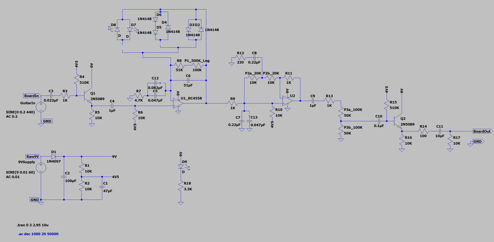

*The circuit shown above is the final LTspice model containing the selected 808 EQ+ modifications.*

Much of the Bass Pass Through and Treb Pass Through development involved experimenting with different capacitor and resistor values, adding components at different points in the signal path, and comparing several switching arrangements. 

The bass experiments focused on adding enough low-frequency content to produce a thicker, fuller sound without allowing the clipped bass frequencies to become excessively strong or muddy. The treble experiments focused on improving transparency, clarity, and presence without making the pedal sound harsh or fizzy. The final values were selected because they produced noticeable but controlled alternatives to the original TS808 response.

Detailed explanations of the selected circuits, component values, and filter corner frequencies are provided in [Bass Pass Through Switching](#bass-pass-through-switching) and [Treb Pass Through Switching](#treb-pass-through-switching).

The clipping experiments compared multiple arrangements of LEDs and 1N4148 silicon diodes. Symmetric, asymmetric, and mixed-diode configurations were evaluated for differences in output volume, compression, sustain, picking dynamics, and overall distortion character.

The final options were selected because each produced a distinct and practical sound: the original-style symmetric silicon configuration provides the familiar TS808 response, asymmetric silicon clipping offers a subtle variation with additional texture, and symmetric LED clipping provides a louder, more open, and dynamic alternative.

For a detailed explanation of the diode arrangements, clipping thresholds, and switch operation, see [Feedback-Loop Diode Clipping](#feedback-loop-diode-clipping) and [Clipping Switches and Configurations](#clipping-switches-and-configurations).

*A photograph of the modified breadboard circuit will be added here.*

Several other possible features were also considered and tested, including:

* A switch for increased distortion
* A switch that changed the output resistor between TS808 and TS9 values
* A wet/dry blend control
* Additional diode configurations

These options were not included in the final design because their changes were underwhelming or insignificant, or because the additional circuitry and controls fell outside the intended scope and complexity of the project.

### 4. Perfboard, Faceless Enclosure, and Prototype Validation

After the breadboard design was stable, it was transferred to perfboard to create a compact, more permanent circuit that reduced loose wiring, established a practical layout, and could be mounted inside a pedal enclosure.

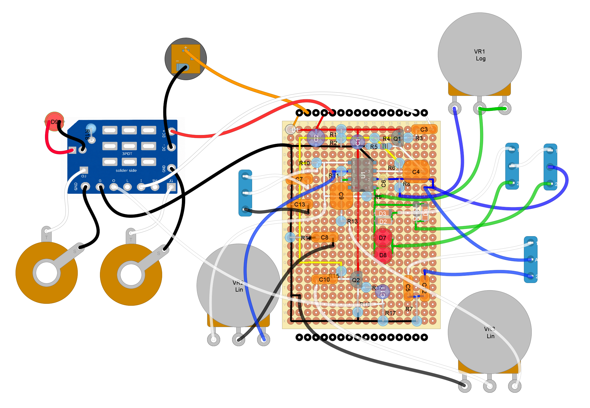

The purpose of this design stage was to:

* Consolidate the circuit
* Integrate the true bypass foot switch
* Reduce breadboard-related connection problems
* Test the design in a more durable and portable pedal format
* Confirm the final circuit before beginning PCB design

The first 3D-printed enclosure prototype was developed in Autodesk Fusion 360 and focused primarily on fit and function rather than appearance. It provided a practical way to mount the circuit and controls before committing to the custom PCB and final enclosure design.

The perfboard + test enclosure prototype was used to confirm:

* Basic effect operation
* True bypass functionality
* Drive, Tone, and Level controls
* Bass and Treble Pass Through behavior
* Symmetric silicon clipping
* Asymmetric silicon clipping
* LED clipping
* Switch interaction
* Practical off-board wiring
* Overall sound and usability

This validation established the final circuit configuration that would then be transferred to a custom PCB.

The perfboard circuit and faceless enclosure also exposed practical problems that were not as apparent during breadboard testing. These steps were helpful in understanding the intricacies of developing an intuitive, visually appealing, and reliable pedal. They allowed me to refine the physical circuit-assembly process, develop a more compact and easy-to-use enclosure, and configure 3D-printing settings that balanced appearance, dimensional accuracy, and functionality.

*Photos of the perfboard circuit and faceless enclosure prototype will be added here.*

### 5. Component Selection and Price Optimization

Considerable time was spent selecting quality components for the later revisions. This work had to be completed before PCB design because the exact component dimensions, pin spacing, and package styles were required to create or verify footprints and plan the board layout.

Many parts used in the early breadboard and perfboard prototypes came from bulk component variety kits. For the custom PCB revision, the goal was to source only the required parts, reduce unnecessary purchases, improve component consistency, and streamline assembly.

Parts were compared through [Octopart](https://octopart.com/) and supplier catalogs from [DigiKey](https://www.digikey.com/), [LCSC](https://www.lcsc.com/), [Tayda Electronics](https://www.taydaelectronics.com/), [Mouser](https://www.mouser.com/en/), and other vendors. DigiKey was selected as the primary source for on-board electronic components because it offered all the required parts, reputable component quality, reasonable pricing, and the ability to consolidate the order through one supplier.

The available options from these suppliers were less suitable for much of the off-board hardware. [Love My Switches](https://lovemyswitches.com/) was selected for affordable, good-quality potentiometers and mono jacks. The SPDT toggle switches and true-bypass footswitches were purchased through Amazon because they were significantly less expensive and the parts had already proved reliable in the first prototype.

Each supplier was chosen by balancing component cost, quality, availability, and total shipping expense. Enough parts were purchased to build five pedals, which reduced the estimated per-pedal cost through quantity pricing and by spreading shipping costs across multiple builds.

All components used in the final design, along with part numbers, quantities, suppliers, and estimated pricing, are listed in the [`808_EQ-Plus_Single_Pedal_BOM.xlsx`](Design/808_EQ-Plus_Single_Pedal_BOM.xlsx) file in the repository’s `Design` folder.

### 6. PCB Design in Altium Designer

The validated circuit was redrawn and laid out in Altium Designer as a compact, reproducible through-hole PCB. The process converted the working prototype into a board that balanced enclosure fit, signal routing, hand-assembly accessibility, serviceability, and support for continued component experimentation.

This stage included building and verifying the component libraries, organizing the circuit into functional blocks, optimizing component placement and routing, preparing clear assembly markings, checking the completed design, comparing fabrication services, and generating the required manufacturing files.

For a complete discussion of the component libraries, construction choices, socketed parts, grounding, routing, manufacturer selection, and fabrication outputs, see [PCB Design](#pcb-design).

### 7. Enclosure Remodeling and Mechanical Integration

After the electronic design and PCB dimensions were better understood, the enclosure was remodeled in Fusion around the physical requirements of the circuit and off-board hardware. Simplified models of the PCB, controls, switches, jacks, power connector, LED, and related hardware were used to refine component spacing, openings, internal clearance, wire routing, assembly access, and the overall enclosure dimensions.

The resulting enclosure was designed specifically for 3D printing and incorporates the pedal’s mounting features, labels, graphics, custom knobs, LED holder, and removable bottom cover into a unified design.

For additional information about the modeling process, component placement, printed labels, materials, multi-color fabrication, tolerances, and print considerations, see [Enclosure Design and 3D Printing](#enclosure-design-and-3d-printing).

### 8. Final Assembly and Testing

The final phase began with assembling the manufactured PCB, inspecting the solder joints, and verifying the orientation of polarized components. The completed board was then tested outside the enclosure so that electrical or assembly problems could be identified and corrected before the off-board components were mounted.

After confirming basic PCB operation, the controls, switches, jacks, LED, and other off-board components were installed. Enclosure fit, bypass operation, effect operation, and every switch configuration were evaluated alongside the pedal’s drive, output level, tone, and overall usability. Any mechanical or electrical issues identified during this process were corrected through further revisions.

The enclosure-printing process was also refined in Bambu Studio to improve appearance, dimensional accuracy, component fit, and overall functionality. 

The completed PCB, enclosure, and assembled pedal have been fully tested and validated. Final fit checks confirmed that the PCB, off-board components, wiring, and printed enclosure function together as intended.

The final manufacturing files, PCB files, CAD exports, print files, dimensional drawings, and other supporting design resources have been released and are available in the repository’s [`Design`](Design/) folder.

---

## Circuit Design

The 808 EQ+ closely follows the original TS808 signal path while adding switchable filter and clipping options.

### Signal-Path Overview

```text
Guitar In
  │
  ▼
Input Buffer
  │
  ▼
Variable-Gain and Clipping Stage
  │
  ▼
Active Tone and Treble-Filtering Stage
  │
  ▼
Level Control
  │
  ▼
Output Buffer
  │
  ▼
True-Bypass Footswitch
  │
  ▼
Effected Guitar Out
```

The circuit can be understood as a sequence of functional stages rather than as one large schematic.

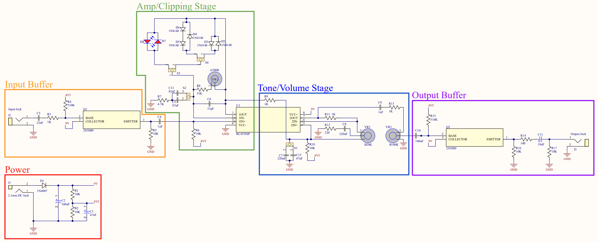

### Power Supply and Bias Network

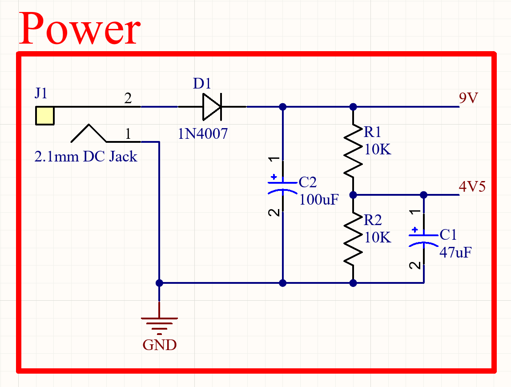

*Altium schematic of the 9 V input, reverse-polarity protection, supply filtering, and power rails.*

#### Power Input and Reverse-Polarity Protection

The pedal is designed for a regulated **9 V DC, center-negative power supply** using the 2.1 mm barrel connector commonly found on modern guitar pedals. In this configuration, the connector’s outer sleeve supplies the positive voltage while its center pin is connected to ground.

D1, a **1N4007 rectifier diode**, is placed in series with the positive supply path to provide reverse-polarity protection. This diode differs from the protection components used in historical TS808 circuits, but it was selected to follow common modern pedal-design practices and provide a robust, readily available replacement. Because D1 is part of the power-supply path rather than the audio signal path, this change has no significant effect on the pedal’s sound or tone during normal operation.

If a supply with the opposite polarity is connected, the diode becomes reverse-biased and prevents significant current from flowing through the circuit. The pedal will not operate, and its transistors, op-amp, and polarized capacitors should be protected from reverse-polarity damage.

The diode protects against reversed polarity, but it does not regulate the input or protect the circuit from excessive voltage. A properly polarized supply significantly above 9 V could exceed component ratings and damage the pedal. A regulated 9 V center-negative supply should therefore always be used.

#### 4V5 Bias Reference

R1 and R2 form a voltage divider that produces a nominal voltage equal to half of the protected supply rail. This node is labeled **4V5** and acts as a virtual midpoint for biasing the audio signal throughout the circuit.

Relatively low divider-resistance values were selected to reduce the reference node’s output impedance. This creates a firmer bias reference that is less susceptible to loading and transient voltage changes.

Because the circuit uses a single positive supply rather than positive and negative power rails, the guitar signal cannot remain centered around 0 V. Doing so would cause the negative half of the waveform to approach the ground rail, where it could be clipped or distorted by the BJTs and op-amp. Biasing the signal near half the supply voltage provides room for both halves of the AC waveform to swing above and below their DC operating point.

#### Supply Filtering and Distribution

C2 filters and stabilizes the protected 9 V rail, while C1 filters and stabilizes the 4V5 reference. Their relatively large capacitances provide a low-impedance path to ground for low-frequency supply ripple, transient disturbances, and some coupled interference. This helps provide cleaner and more stable power to the audio circuit, although it cannot eliminate every possible source of power-supply or radio-frequency noise.

The protected 9 V rail powers the active devices directly, including the op-amp supply and BJT collectors. The 4V5 reference is distributed through biasing resistors to establish the DC operating point at the beginning of the circuit’s audio stages. 

#### Nominal and Actual Voltages

Labels such as **9V** and **4V5** describe the intended function of these rails rather than guaranteed measured voltages. The actual DC supply may differ slightly from exactly 9 V, and D1 introduces a forward-voltage drop that is typically around 0.7 V, although it varies with current and temperature. As a result, the protected rail may be closer to approximately 8–8.5 V when powered by a nominal 9 V supply, and the divided reference will be approximately half of that value.

A biasing resistor also does not automatically create a fixed voltage drop; the drop depends on the current flowing through it. Op-amp inputs draw very little current and may remain close to the 4V5 reference, while BJT bias nodes may differ more because of base current and surrounding component values.

These variations are expected and do not prevent normal operation. The important requirement is that each stage maintains a stable operating point with enough headroom for the guitar waveform. A guitar signal is often only a few hundred millivolts during typical playing, although strong transients from high-output pickups can approach roughly 2 V peak-to-peak or more.

### Input Buffer

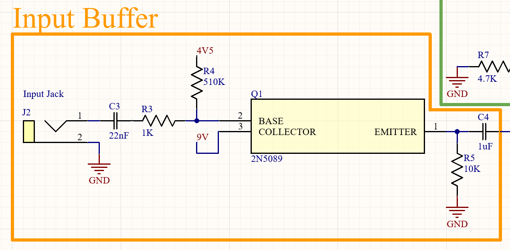

*Altium schematic of the input jack, coupling capacitors, bias network, and BJT emitter-follower buffer.*

#### Purpose and Impedance

The input buffer provides a stable interface between the guitar and the rest of the effect circuit. It isolates the guitar pickups from the more complex loading conditions created by the clipping stage and allows the original signal to be passed forward without intentional voltage amplification.

A good guitar buffer has a **high input impedance** and a **low output impedance**. An input impedance near 1 MΩ is commonly considered desirable, although values of several hundred kilohms are also widely used in guitar pedals. A high input impedance prevents the circuit from drawing substantial current from the pickups and reduces the damping of their natural frequency response. In this circuit, R4 and the transistor’s base impedance provide a sufficiently high input impedance for the guitar signal.

Cable and wiring capacitance can contribute to unwanted filtering. Before the buffer, the guitar pickup impedance, cable capacitance, and pedal input impedance form a more complex frequency-dependent network that can reduce high-frequency content and alter the pickup resonance. Commonly described as “tone sucking,” this effect becomes more noticeable when the following circuit presents too low of an input impedance or when long cables add substantial capacitance.

After the buffer, the interaction can be approximated more simply using:

`f_c = 1 / (2πRC)`

In this relationship, reducing the driving resistance moves the low-pass corner frequency upward. The buffer’s low output impedance therefore allows it to drive the following circuit and its associated capacitance without producing significant filtering within the audible range. A buffer cannot recover high frequencies already lost in the cable before it, but it prevents the following pedal stages from adding substantial additional loading.

#### Input Jack

The input uses a mono 1/4-inch audio jack. The sleeve is connected to circuit ground, while the tip carries the guitar signal into the input buffer.

Stereo input jacks are often used in pedals to disconnect an internal battery when the instrument cable is removed. Battery operation was outside the scope of this project, so a mono jack was selected to simplify the wiring and reduce cost.

#### Coupling Capacitors and Bias Transfer

C3 is an input coupling capacitor. The guitar signal arriving from the input jack is centered around 0 V, while the transistor base must operate at a positive DC bias. C3 blocks the guitar’s original DC level while allowing its AC audio content to pass into the transistor’s bias network.

R4 connects the transistor base to the 4V5 reference, causing the incoming guitar waveform to become centered around the nominal half-supply voltage. This provides room for the signal to swing above and below its new DC operating point without approaching the circuit’s ground rail.

C4 performs a similar function at the buffer output. Because the transistor is configured as an emitter follower, its emitter sits approximately one base-emitter voltage drop below the base—typically around 3–4 V DC in this circuit. C4 blocks that emitter DC level while passing the AC guitar signal to the clipping stage, where it is established around that stage’s own nominal 4V5 bias.

In addition to transferring signals between different DC operating points, the coupling capacitors interact with the surrounding resistances to form high-pass filters. Their values were selected so the desired guitar-frequency range can pass without excessive low-frequency loss.

#### BJT Emitter-Follower Configuration

The BJT is configured as an **emitter follower**, also called a **common-collector amplifier**. The input signal enters through the base, and the buffered output is taken from the emitter. The collector is connected directly to the protected 9 V rail, which supplies the transistor’s operating current and establishes its upper voltage limit.

R3 is a small series base resistor that provides isolation, limits transient base current, and can help reduce unwanted high-frequency or radio-frequency behavior. R4 supplies the base bias while also contributing to the buffer’s input impedance.

R5 provides the emitter with a path to ground and helps establish the transistor’s quiescent current and DC operating point. It also introduces negative feedback: changes in emitter current change the voltage across R5 in a direction that resists further change, improving stability.

An emitter follower has a voltage gain slightly below 1, so it does not significantly amplify the guitar waveform. Its primary benefit is current gain and impedance conversion. The original high-impedance guitar signal is reproduced at the emitter as a lower-impedance, higher-drive signal that can reliably feed the clipping stage.

### Variable-Gain and Clipping Stage

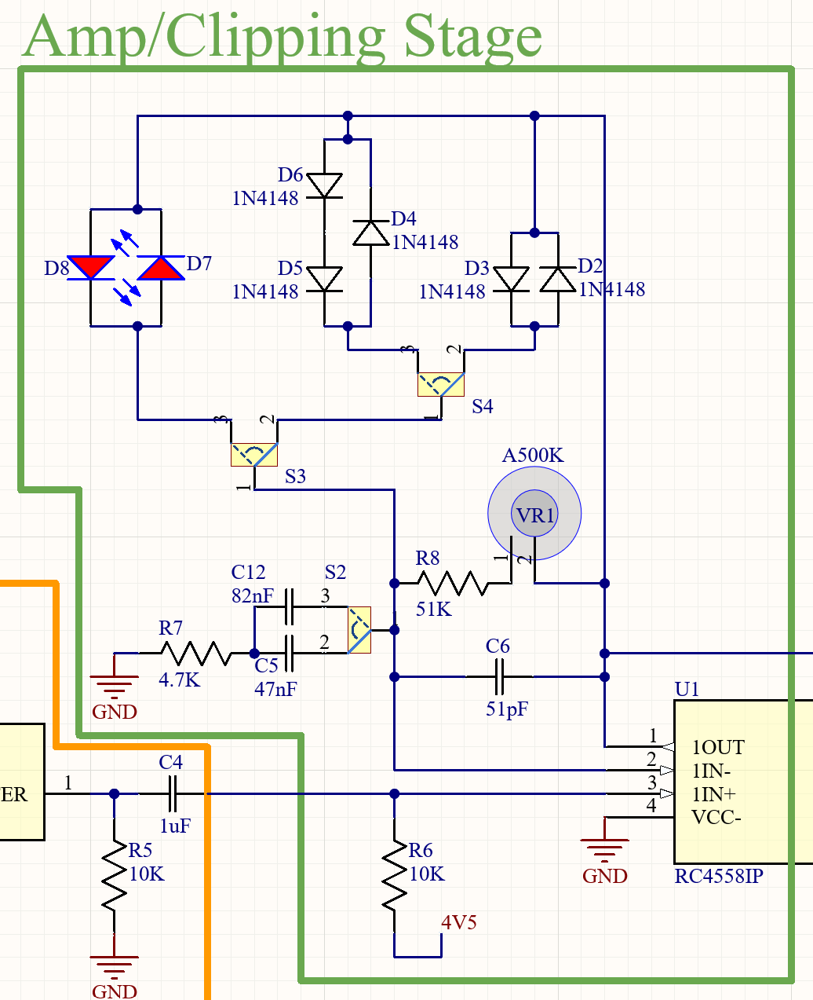

*Altium schematic of the non-inverting op-amp gain stage, frequency-dependent feedback network, Bass Pass Through switching, and selectable diode-clipping configurations.*

#### High-Level Behavior

The purpose of this stage is to add controlled, musically useful distortion to the guitar signal. The input is amplified by an op-amp in a non-inverting configuration until the voltage across the feedback network becomes large enough to forward-bias the clipping diodes. As the diodes begin conducting, they reduce the stage’s effective gain and progressively limit the waveform’s peaks. This produces the smoother transition into distortion commonly described as **soft clipping**.

Rather than amplifying every frequency equally, the TS808 feedback network reduces the gain applied to lower frequencies. This keeps excessive bass out of the clipped signal and helps prevent the distortion from becoming loose or muddy. The stage’s frequency-dependent gain, phase response, and diode clipping combine to produce the Tube Screamer’s characteristic waveform, including its tilted and rounded peaks and valleys.

This stage also contains the Bass Pass Through modification and the switches used to select the three clipping configurations.

#### Non-Inverting Amplifier and Drive Control

The op-amp is configured as a non-inverting amplifier. Within the frequency range where the feedback capacitors are not substantially affecting the circuit, its closed-loop gain can be approximated as:

`Gain = 1 + (Rf / Rg)`

In this circuit, `Rf` is primarily formed by R8 and the variable resistance of the Drive potentiometer, while `Rg` is R7. This produces an approximate midband gain range of **12 to 120**.

At the minimum Drive setting, the potentiometer’s wiper and connected outer terminal produce nearly 0 Ω of additional feedback resistance. The gain is then determined primarily by R8 and R7. Turning the Drive control clockwise increases the potentiometer resistance in the feedback path, raising the stage gain and driving the clipping diodes harder.

These gain values are frequency-dependent rather than constant across the entire guitar spectrum. At sufficiently low frequencies, the impedance of C5 or C12 causes the gain to fall toward unity. At very high frequencies, C6 also reduces the gain.

#### Frequency-Dependent Feedback

A capacitor’s opposition to AC current is called **capacitive reactance** and can be approximated as:

`Xc = 1 / (2πfC)`

Capacitive reactance decreases as frequency increases.

C6 is connected across the op-amp’s feedback resistance. At low and middle frequencies, its reactance is high, so the Drive potentiometer and R8 primarily determine `Rf`. At very high frequencies, C6 presents a lower-impedance path around the feedback resistance. This lowers the effective value of `Rf`, reduces the stage gain, and helps prevent very high-frequency noise and harsh, fizzy content from being excessively amplified.

C5 and C12 create the opposite frequency-dependent effect because the selected capacitor is placed in series with R7 in the feedback path to ground. At higher frequencies, the capacitor’s reactance is low and the stage operates near the gain predicted by `1 + Rf/R7`. As frequency decreases, the capacitor’s reactance rises, increasing the impedance of the feedback path to ground (`Rg`) and reducing the stage gain toward unity.

The result is a high-pass response in the stage’s distortion gain: middle and upper frequencies receive substantial amplification and clipping, while lower frequencies remain comparatively cleaner.

#### Bass Pass Through Switching

The original C5 value creates a distortion-stage high-pass corner at approximately **720 Hz**. Selecting C12 lowers this corner to approximately **410 Hz**, allowing more low-frequency content to receive the additional gain needed to enter clipping.

The Bass Pass Through capacitor value was chosen to give the guitar a thicker and fuller low end without allowing the distorted bass frequencies to become excessively strong or muddy.

A passive SPDT switch selects between C5 and C12. This keeps the modification simple and avoids placing an additional active switching circuit inside the sensitive feedback network. However, the inactive capacitor does not have a dedicated discharge path and may retain a small charge. A brief switching pop may therefore occur when changing between the Bass Cut and Bass Pass Through settings.

C5 and C12 also introduce a frequency-dependent phase shift, particularly around their respective corner frequencies. This phase response contributes to the shape of the resulting waveform, although the visible waveform is produced by the combined effects of filtering, amplification, clipping, and phase shift rather than by a simple time delay alone.

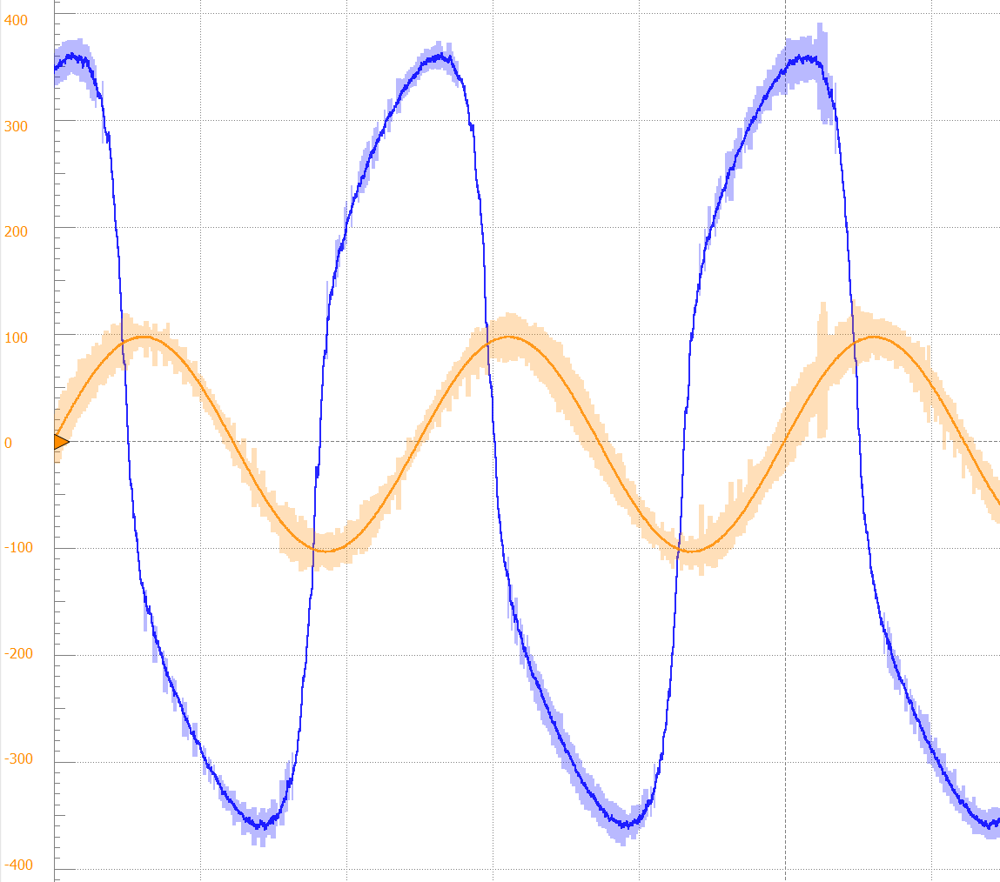

*Measured Tube Screamer-style waveform showing the characteristic shape produced by frequency-dependent amplification, capacitor phase shift, and feedback-loop clipping. Input is orange, and output is blue.*

#### Feedback-Loop Diode Clipping

The clipping diodes are connected inside the op-amp feedback loop. When the voltage difference across the diode network remains below its forward-conduction threshold, the diodes have little effect and the op-amp operates at the gain established by the feedback resistors.

As the amplified signal increases, the diodes begin to conduct and provide a lower-impedance feedback path. This increases negative feedback and reduces the stage’s effective gain near the waveform peaks. Because diode conduction increases progressively rather than switching instantaneously, the peaks are rounded instead of being cut off abruptly.

The 1N4148 silicon diodes have a forward voltage of approximately **0.6–0.7 V**, while the red LEDs have a substantially higher forward voltage of approximately **1.8 V**. The exact values vary with current, temperature, and the individual components.

Lower-forward-voltage diodes begin clipping at a lower signal level, producing greater compression and a tighter, more saturated response. Higher-forward-voltage diodes allow the op-amp output to reach a greater amplitude before substantial clipping occurs, resulting in more output volume, greater headroom, less compression, and a more dynamic response.

Amplification + clipping reduces the difference between louder and quieter portions of the signal. This compression can make the decaying portion of a note remain more consistent in volume and distortion character, which is often perceived as increased sustain.

#### Clipping Switches and Configurations

The **Tight/Open** switch selects between the silicon-diode network and the symmetric LED network:

* **Tight** engages the 1N4148 silicon clipping selected by the Sym/Asym switch.
* **Open** engages symmetric red-LED clipping and bypasses the Sym/Asym selection.

The **Sym/Asym** switch only affects the silicon clipping network:

* **Sym** uses one 1N4148 diode in each direction for the traditional symmetric TS808 configuration.
* **Asym** uses one 1N4148 in one direction and two series-connected 1N4148 diodes in the opposite direction, producing different positive and negative clipping thresholds.

| Tight/Open | Sym/Asym | Clipping configuration | General character |
| --- | --- | --- | --- |
| **Tight** | **Sym** | Symmetric silicon clipping | Traditional TS808-style clipping with relatively low headroom, moderate compression, and an even response on both halves of the waveform. |
| **Tight** | **Asym** | Asymmetric silicon clipping | Unequal clipping thresholds produce slightly greater output, less uniform compression, and additional even-order harmonic content associated with a thicker, more textured sound. |
| **Open** | Either position | Symmetric LED clipping | The higher clipping threshold provides substantially greater output, more headroom, reduced compression, and a more dynamic distortion response. |

The three configurations were selected because they provide distinct but practical variations without moving too far from the original TS808 character.

### Active Tone Stage

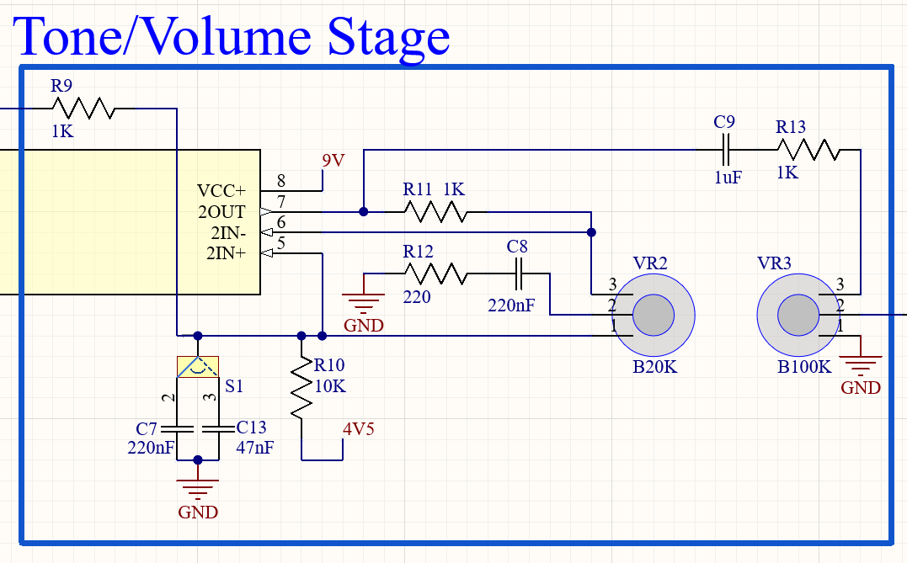

*Altium schematic of the fixed low-pass filter, active upper-frequency boost, Tone control, Treb Pass Through modification, and Level control.*

#### High-Level Function

This stage provides control over the pedal’s upper-midrange and treble response. It combines a passive low-pass filter with an active, frequency-dependent op-amp stage. The Tone potentiometer blends between the darker filtered interaction and the brighter actively boosted interaction, allowing the player to move gradually from substantial treble reduction to a more bright and present response.

The selected signal is then passed to the Level potentiometer, which controls the overall output amplitude. The coupling and buffering circuitry surrounding the Level control prevents the DC bias and external load from substantially interfering with the tone circuit.

#### Frequency-Dependent Signal Paths

The tone stage contains two primary frequency-dependent paths. The first is a low pass filter formed by R9 and either C7 or C13, depending on the position of the Treb Pass Through switch. The output is connected to the non-inverting (`+`) input of the op-amp. This filter's corner frequency is around 720 Hz. It cuts upper mid and high frequencies and sends the rest through the remainder of the tone circuit.

The second frequency-dependent path is formed by R12 and C8. This path can be reached from the initial low-pass-filtered path through one portion of the Tone potentiometer. C8 and R12 also interact with the op-amp feedback loop through the other side of the Tone potentiometer.

#### Active Upper-Frequency Boost

The op-amp is configured as a non-inverting amplifier. R11 forms the feedback resistance, while the Tone potentiometer, R12, and C8 form the frequency-dependent path from the inverting input to ground. Initially, it is helpful to analyze this portion of the circuit assuming the Tone pot is positioned all the way clockwise, giving a direct path from the feedback loop through C8 and R12 to ground.

At lower frequencies, C8 has relatively high capacitive reactance. This restricts current through the feedback path to ground and causes the op-amp gain to remain close to 1.

At higher frequencies, C8’s reactance decreases, leaving R12 as the primary resistance in the feedback path to ground. The high-frequency gain can then be approximated as:

`Gain = 1 + (R11 / R12)`

Using the selected component values, the maximum high-frequency gain is approximately **5.5**. This means the active path can amplify upper-frequency content by roughly five times relative to its low-frequency gain.

However, this does not mean the pedal’s final treble output is five times greater than the original guitar signal. The active boost occurs after the R9 and C7/C13 low-pass filter, which has already reduced some of the upper-frequency content. The final response results from the interaction between the initial low-pass filter, active high-frequency boost, Tone-pot position, and surrounding circuit impedances.

Although this simplified analysis does not capture every interaction in the circuit, it provides an intuitive explanation of how the tone stage can move between substantial treble reduction and an actively emphasized upper-frequency response.

#### Tone-Pot Operation

With the Tone control turned fully counterclockwise, its wiper is positioned toward the passive low-pass side of the circuit. This effectively puts C8 and R21 in parallel with C7 or C13. This leads to a stronger reduction in upper-midrange and treble content. Simultaneously, the Tone pot's full resistance is contributed to `Rg` and the gain of the non-inverting op amp is reduced close to unity. These interactions produce a much darker, muted output.

With the Tone potentiometer turned fully clockwise, upper frequencies are actively boosted, providing substantially more upper-midrange and treble content. At the same time, 
the Tone potentiometer reduces current flow through C8 and R12, preventing higher frequencies from being cut as dramatically. This results in a significantly brighter and potentially harsh output.

Intermediate settings blend the two responses nicely, allowing the player to adjust the pedal continuously between a darker, more heavily filtered sound and a brighter, more present sound.

#### Treb Pass Through Switching

S1 and C13 form the **Treb Pass Through** modification. The SPDT switch selects the capacitor used with R9 in the tone-stage low-pass filter:

* Selecting C7 restores the original TS808-style corner frequency of approximately **720 Hz**.
* Selecting C13 raises the corner frequency to approximately **3.4 kHz**.

Raising the corner frequency allows substantially more upper-frequency content to reach the active tone circuit. C13 was selected to provide noticeably greater clarity, presence, and transparency without making the pedal excessively harsh or fizzy.

The Treb Pass Through switch changes the signal entering both sides of the Tone control. The Tone potentiometer continues to provide its normal dark-to-bright adjustment, but the overall available frequency range is extended when C13 is selected.

#### Level Control

After the Tone control selects the desired blend of passive and active responses, the AC signal is coupled to the Level potentiometer. The Level pot is configured as a voltage divider between the tone-stage output and ground.

At lower settings, a larger portion of the signal is directed toward ground and a smaller signal is taken from the wiper. Turning the Level control clockwise increases the proportion of the signal passed to the output buffer.

The Level control only attenuates the available signal; it does not provide additional gain. Its purpose is to set the final pedal output volume after the distortion and tone-shaping stages.

### Output Buffer

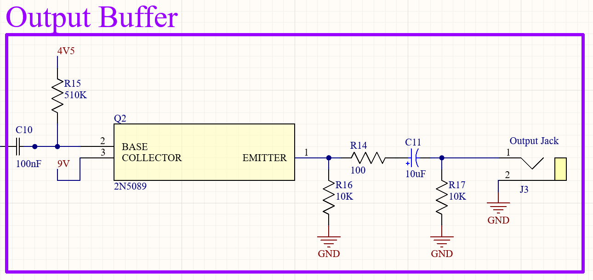

*Altium schematic of the BJT output buffer, output coupling capacitor, pull-down resistor, and output jack.*

#### Purpose and Impedance

The output buffer performs a function similar to the [Input Buffer](#input-buffer), but its design priorities are slightly different. An extremely high input impedance is less critical here because the buffer is driven by the low-impedance tone-stage op-amp through the Level control rather than directly by passive guitar pickups. 

Greater emphasis is placed on producing a low output impedance so the pedal can reliably drive an amplifier, another pedal, and the capacitance of the connected cable without significant signal loss or unwanted filtering.

The BJT uses essentially the same emitter-follower configuration as the input buffer. It provides a voltage gain close to 1 while increasing the available current drive and lowering the signal’s output impedance. See the [Input Buffer](#input-buffer) section for a more detailed explanation of emitter-follower operation.

#### Final Signal Preparation

The BJT emitter operates at a positive DC bias, but other pedals and amplifiers generally expect an audio signal centered around 0 V. C11 acts as the final coupling capacitor, blocking the buffer’s DC bias while allowing the AC guitar signal to pass to the output jack.

R17 is connected between the output side of C11 and ground. It establishes a 0 V DC reference and gives C11 a path to discharge when no output cable is connected. This prevents the output node from floating and helps reduce loud pops when connecting the pedal to other equipment.

C11, R17, and the input impedance of the connected equipment form a high-pass filter. Their values were selected to place the filter corner below the desired guitar-frequency range, preventing noticeable bass loss. The surrounding buffer components were selected to maintain a stable operating point and sufficiently low output impedance.

The prepared signal is delivered through the tip of the mono output jack, while the sleeve provides the ground connection.

### True-Bypass and LED Circuit

#### 3PDT Switching

Several mechanical true-bypass wiring arrangements are commonly used and can be found online. A 3PDT footswitch is especially useful when true-bypass signal routing, effect-input grounding, and LED indication must all be controlled by one switch.

A 3PDT switch contains three electrically independent poles that change state together. Each pole has a center common lug that connects to one of two outer lugs depending on the footswitch position. The switches purchased for this project included small breakout PCBs that simplify these connections and reduce the amount of point-to-point wiring required during assembly.

In this implementation, the three center connections correspond to the input jack, ground, and output jack. Pressing the footswitch connects these points to one of two sets of switched contacts.

#### Bypass State

When the effect is bypassed, the input jack is connected directly to the output jack. The guitar signal therefore travels through the mechanical switch without passing through the pedal’s input buffer, clipping stage, tone circuit, or output buffer.

At the same time, the effect-circuit input is connected to ground. Grounding the unused input prevents it from floating, where it could collect noise or create unpredictable behavior that becomes audible when the effect is re-engaged.

“True bypass” refers to the audio signal being disconnected from the effect circuit. The internal circuit may remain electrically powered even while bypassed, but it is removed from the active guitar-signal path.

#### Effect State

When the effect is engaged, the input jack is connected to the effect-circuit input and the effect-circuit output is connected to the output jack. The guitar signal then passes through the complete pedal circuit before continuing to the next pedal or amplifier.

The third pole completes the status-LED circuit, illuminating the LED to indicate that the effect is active.

#### LED Current Limiting

An LED requires a series current-limiting resistor to prevent excessive current from damaging the LED or placing unnecessary load on the power supply. The required resistance depends on the supply voltage, the LED’s forward voltage, and the desired operating current:

`R = (Vsupply - Vf) / ILED`

The LED forward voltage depends on its color and construction, while the selected current determines its brightness. In practice, a standard resistor value at or above the calculated resistance should be selected to keep the LED within its rated current. A lower-current operating point is often sufficient for a pedal indicator and reduces power consumption.

#### True Bypass Versus Buffered Bypass

Some pedals use buffered bypass, meaning the guitar signal continues to pass through an active buffer even when the effect itself is disabled. This can provide a low output impedance that helps drive long cables and other pedals, but it also means the bypassed signal is not completely isolated from the pedal’s electronics.

The 808 EQ+ does not use buffered bypass. When bypassed, the guitar signal follows a passive mechanical path directly from the input jack to the output jack. The pedal’s input and output buffers are only part of the signal path while the effect is engaged.

---

## PCB Design

The custom PCB was developed in Altium Designer to translate the validated prototype into a more durable, reproducible, and serviceable format.

### Process Overview

The PCB was developed through the following process:

1. Collect, revise, and organize the required schematic symbols and PCB footprints.
2. Redraw the complete schematic and assign the verified components, footprints, and designators.
3. Define the board shape and systematically place the through-hole components.
4. Position the off-board connection pads and orient component labels, values, and polarity markings for straightforward assembly.
5. Route the signal and power traces, then create the top and bottom ground pours.
6. Run electrical- and PCB-design-rule checks, correcting any identified problems.
7. Review the completed board in both 2D and 3D.
8. Generate the fabrication files and inspect the manufacturer previews before ordering.

| PCB top                                           | PCB bottom                                              |
| ------------------------------------------------- | ------------------------------------------------------- |
| 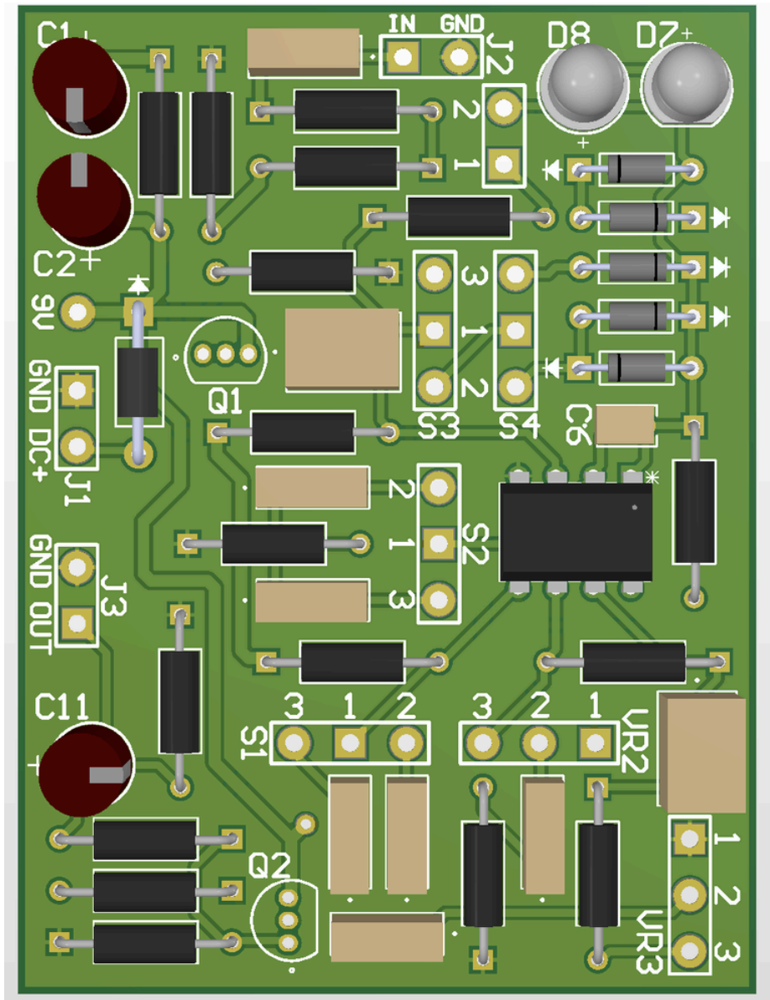 | 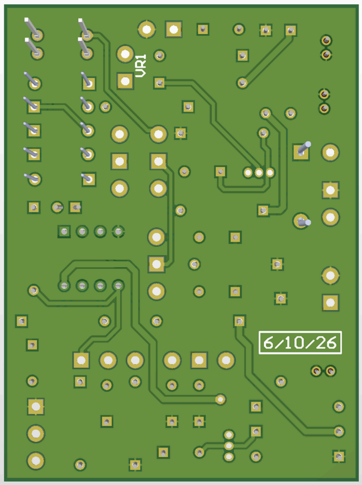 |

### Design Priorities

The PCB was designed around the following priorities:

* Preserve the validated TS808-style circuit
* Use readily solderable through-hole components
* Grouping components by functional circuit block
* Provide practical connection points for off-board wiring
* Support component replacement and experimentation
* Fit efficiently within the custom printed enclosure
* Minimize trace length, unnecessary crossings, and layer changes
* Provide clearly aligned component designators, value labels, and polarity markings
* Make fabrication possible through common prototype-PCB services

### Library Development

Many schematic symbols and PCB footprints were sourced from DigiKey and collected into organized Altium project libraries. Each resource was reviewed for dimensional accuracy and checked against the corresponding component datasheet to verify its pinout, package dimensions, and lead spacing. Existing library components were corrected when necessary, and custom symbols or footprints were created when suitable resources were unavailable.

The completed Altium library files are available in the repository’s [`Design/PCB/Altium`](Design/PCB/Altium/) folder.

### Through-Hole Components

Through-hole components were selected because they are relatively easy to solder by hand, inspect visually, and replace when necessary. They are also familiar to many hobbyists, readily available in small quantities, and compatible with machine-pin sockets for experimentation or repair. 

Although through-hole construction requires more board space than surface-mount construction, the increased accessibility and serviceability made the larger PCB area a worthwhile tradeoff.

### Socketed and Replaceable Components

Selected components can be installed in machine-pin sockets.

This is useful for:

* Comparing op-amps
* Comparing clipping diodes
* Replacing transistors
* Revising filter capacitors
* Troubleshooting damaged components
* Experimenting without repeatedly heating PCB pads

Sockets should be used selectively. Permanently installing every component in a socket would increase cost, assembly time, contact resistance, and the risk of intermittent connections.

Suggested components for machine-pin sockets include Q1, Q2, U1, C12, C13, and the clipping diodes. These locations are especially useful for tone experimentation, troubleshooting, repair, and comparing compatible replacement components.

### Routing and Grounding

The circuit’s typical current draw was measured at approximately **7–10 mA**. This range was entered into a PCB trace-width calculator, but the low current produced unusually narrow minimum-width recommendations. After researching trace widths commonly used by other guitar-pedal designers, wider traces were selected to provide more practical fabrication margins and greater physical robustness. The final layout uses **0.8 mm traces for the power rails** and **0.6 mm traces for signal paths**.

Signal traces were routed with attention to:

* Keeping related components close together
* Minimizing board area and trace length
* Reducing unnecessary trace crossings and layer changes
* Separating sensitive signal paths from power wiring
* Avoiding interference with through-hole pads
* Maintaining fabrication clearances

The board uses copper pours on both sides for ground distribution.

### Manufacturer Selection and Design Files

Several PCB manufacturers, including [OSH Park](https://oshpark.com/), [JLCPCB](https://jlcpcb.com/), [PCBWay](https://www.pcbway.com/orderonline.aspx), and [Elecrow](https://www.elecrow.com/pcb-manufacturing.html), were considered for producing the final board. Pricing, order quantities, fabrication options, shipping costs, turnaround time, and experiences reported by other hobbyists were compared. JLCPCB was ultimately selected because it offered an affordable option for the required boards and had received substantial positive feedback from other users online.

The relevant Altium project files, Gerber files, drill files, and other manufacturing outputs are available in the repository’s [`Design/PCB`](Design/PCB/) folder.

*Physical bare-PCB and assembled-PCB photographs will be added after final documentation is complete.*

---

## Enclosure Design and 3D Printing

The enclosure was designed as an integrated part of the project rather than as a generic box added after the electronics were complete.

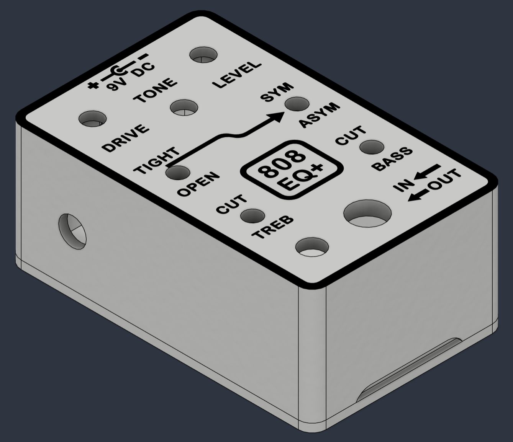

### Why Use a Printed Enclosure?

A printed enclosure provides several advantages:

* Lower cost than many commercial pedal enclosures
* Freedom over the outer shape and proportions
* Integrated labels and symbols
* Rapid revision of holes and component spacing
* Custom knobs and LED hardware
* Multiple colors without decals or screen printing
* Easy reproduction from digital files

The main tradeoffs are:

* Reduced impact resistance
* Reduced temperature resistance
* Reduced electromagnetic shielding
* Potentially longer fabrication time
* Greater dependence on print orientation and tolerances

> **Warning:** Common 3D-printing plastics may soften, warp, or deform at temperatures that would not damage a metal enclosure.

### Component-Driven Design

All enclosure-mounted components were modeled specifically for this project, including the potentiometers, toggle switches, footswitch, input and output jacks, DC power connector, PCB boundary, and LED. No existing component models were imported. Nuts, washers, and other fasteners were excluded because their detailed geometry was not necessary for the enclosure design.

These component models were used to determine the required hole diameters, internal spacing, PCB position, wire-routing space, footswitch clearance, jack depth, wall thickness, bottom-cover geometry, and tool access needed during assembly.

| Component placement                                               | Enclosure interior                                                      |
| ----------------------------------------------------------------- | ----------------------------------------------------------------------- |
| 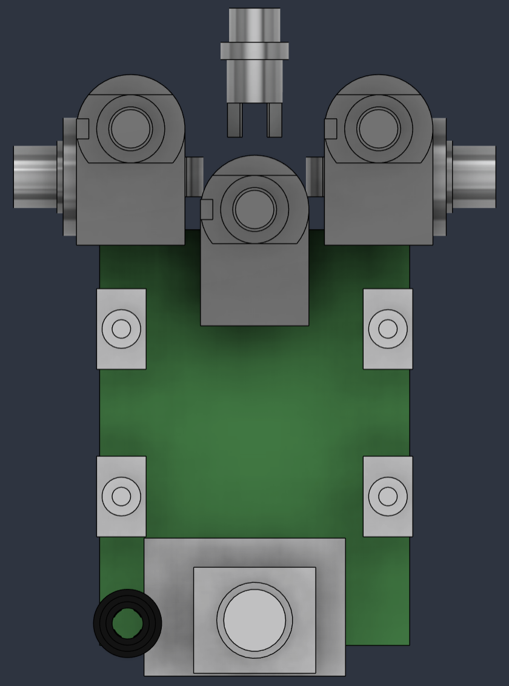 | 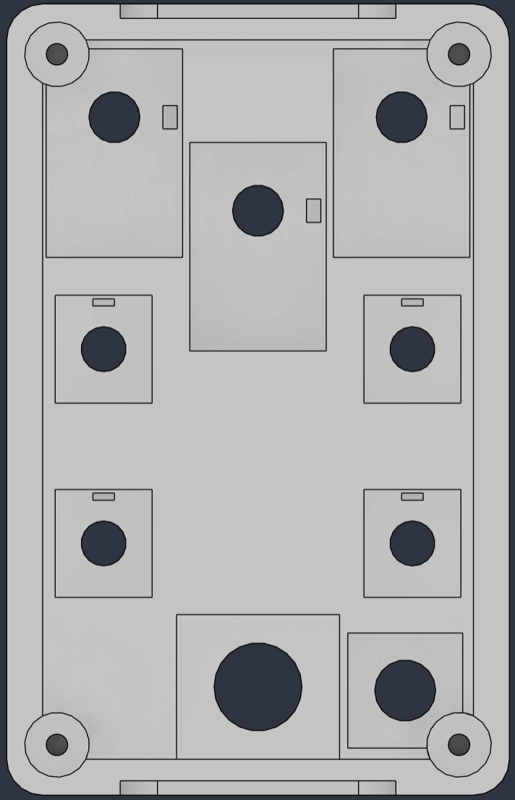 |

The enclosure also includes:

* Custom printed knobs
* A custom LED holder
* Bottom-cover locating features
* Openings for enclosure-mounted components
* Print-aware wall thicknesses and tolerances
* A small access cutout that makes the bottom plate easier to remove after its screws have been removed

Dedicated PCB mounting features were intentionally omitted to simplify the enclosure design and final assembly process. Because the internal layout is compact, the PCB does not move freely once the pedal is fully assembled. The connected wiring constrains its position, while the bottom plate limits vertical movement and keeps the board mostly stationary inside the enclosure.

### Printed Labels and Graphics

The face labels and symbols are integrated into the enclosure model rather than applied afterward.

Contrasting filament is inlaid flush with the enclosure surface. The label geometry is designed to print against the build plate, producing a clean, flat front face without raised or recessed lettering.

A smooth PEI plate was used to improve the finish and readability of the labels. A textured plate may also work, but it can produce a shinier surface texture, less crisp lettering, more irregular edges, and blobbier or harder-to-read small text

### Multi-Color Printing

The current design uses **white filament** for most of the enclosure and selected accents on the knobs and LED holder. **Black filament** is used for the front-face inlays and as the primary color of the knobs and LED holder.

The Bambu H2S natively supports automatic multi-color printing, although each filament change produces additional purge waste. Because a single layer of black filament remained clearly visible against the white enclosure, the front-face inlays were intentionally made only one layer deep. This minimized the number of filament changes and reduced the amount of material wasted during purging.

The uploaded enclosure print files work best when the accent color is significantly darker than the primary enclosure color. Simply reversing the original color scheme would not produce an equivalent result. A single white inlay layer surrounded by black material would have poor opacity, appear closer to dark gray, and be much less visible than the black-on-white inlays.

Light or translucent accent colors should therefore be avoided when the primary enclosure color is dark. To use that type of color combination successfully, the inlay geometry should be modified to extend across additional layers, increasing its thickness and opacity. Other color combinations can be used without changing the enclosure’s overall mechanical design, provided that the contrast and opacity of the selected filaments are considered.

Multi-color fabrication is not strictly required. Possible alternatives include:

* Using recessed or raised labels and graphics
* Manually changing filament when printing
* Painting or filling the label geometry after printing
* Printing separate label inserts
* Omitting the cosmetic accents

| Sliced enclosure | Sliced underside |
| --- | --- |
|  |  |

### Final Print Files and Recommended Settings

The enclosure design, print settings, tolerances, component fit, and appearance have been finalized and physically validated. The related files are available in the repository’s [`Design/3D_Printing`](Design/3D_Printing/) folder.

The provided file types serve different purposes:

* **STL files** contain the printable geometry for the enclosure and related parts. They can be imported into most slicers but do not preserve filament assignments, object placement, or slicer settings.
* **3MF files** contain prepared Bambu Studio projects with the models, object arrangement, filament assignments, and tested slicer settings. These files provide the best starting point for reproducing the validated prints on a compatible Bambu printer.

> [!CAUTION]
> The provided files and settings do not guarantee identical results on every printer. Dimensional accuracy, tolerances, surface finish, and label clarity can vary with the printer, filament, build plate, calibration, environmental conditions, and slicer version.
>
> The enclosure was designed around the specific off-board components listed in the project BOM. Substituting potentiometers, switches, jacks, connectors, fasteners, or other hardware may introduce dimensional differences that affect fit and assembly. Printed parts may require adjustment or reprinting, and the inlaid graphics and labels may not appear as clear as expected on every setup.
>
> The following settings produced the best results during development and may provide a useful starting point for further printer-specific tuning.

#### Importing, Positioning, and Model Preparation

When preparing the STL files manually:

1. Import the STL assembly containing the enclosure, inlays, and bottom plate.
2. Use **Lay on Face** to place the assembly on the enclosure’s top surface so the inlays contact the build plate.
3. Split the assembly into separate objects.
4. Move the bottom plate beside the enclosure.
5. Use **Lay on Face** to place the flat outer face of the bottom plate against the build plate.
6. Assign the appropriate filament to each object:
   * Assign filament 1 as the secondary accent color—black in the validated print.
   * Assign filament 2 as the primary enclosure color—white in the validated print.
   * In the **Objects** tab, assign the enclosure and bottom plate to the primary enclosure color.

#### Filament Printing Sequence

The accent inlays should print before the primary enclosure material:

1. Open the plate-specific customization settings.
2. Set **First layer filament sequence** to **Customize**.
3. Print the accent color first and the primary enclosure color second.
4. If the inlays extend beyond the first layer, configure **Other layer filament sequence** in the same order.

#### Modified Global Settings

| Setting | Validated value |
| --- | --- |
| Initial-layer line width | 0.42 mm |
| Seam position | Back |
| Elephant-foot compensation | 0.08 mm |
| Wall loops | 4 |
| Bottom shell layers | 4 |
| Internal solid infill pattern | Monotonic line |
| Sparse infill density | 25% |
| Sparse infill pattern | Cubic |
| Initial-layer speed | 25 mm/s |
| Support | Enabled |
| Support type | Normal (auto) |

#### Object-Specific Settings

For the enclosure and bottom plate:

* Enable **Only one wall on first layer**.
* Set **Bottom surface pattern** to **Monotonic Line**.

For the inlaid arrows and border:

* Set **Bottom surface pattern** to **Concentric**.
* Set **Seam position** to **Aligned**.

For the `9` object:

* Set **Seam position** to **Aligned**.

#### Seam Painting

Seam placement is particularly important around the bottom plate’s locating pegs and the corresponding slots in the enclosure. Poorly positioned seams can make these features larger or more irregular than intended and interfere with assembly.

* Paint the seam on each bottom-plate peg so it faces toward the center of the bottom plate.
* Verify that the corresponding peg slots in the enclosure do not contain seams that could interfere with insertion.
* If desired, align the enclosure’s outer seam with the bottom plate’s outer seam for a more consistent appearance.

---

Return to the [main project README](README.md).
